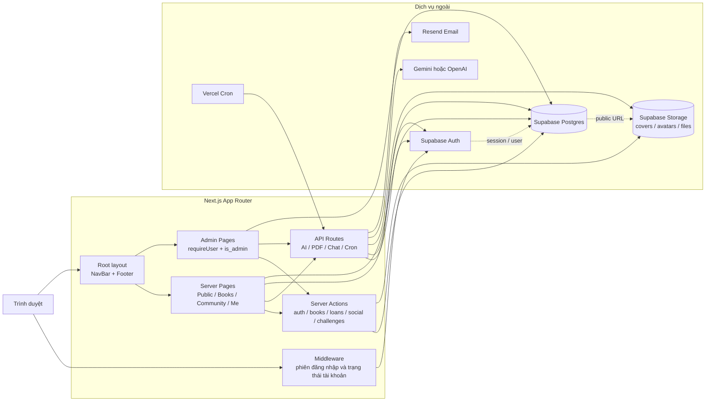
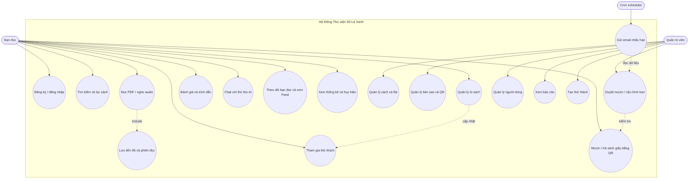
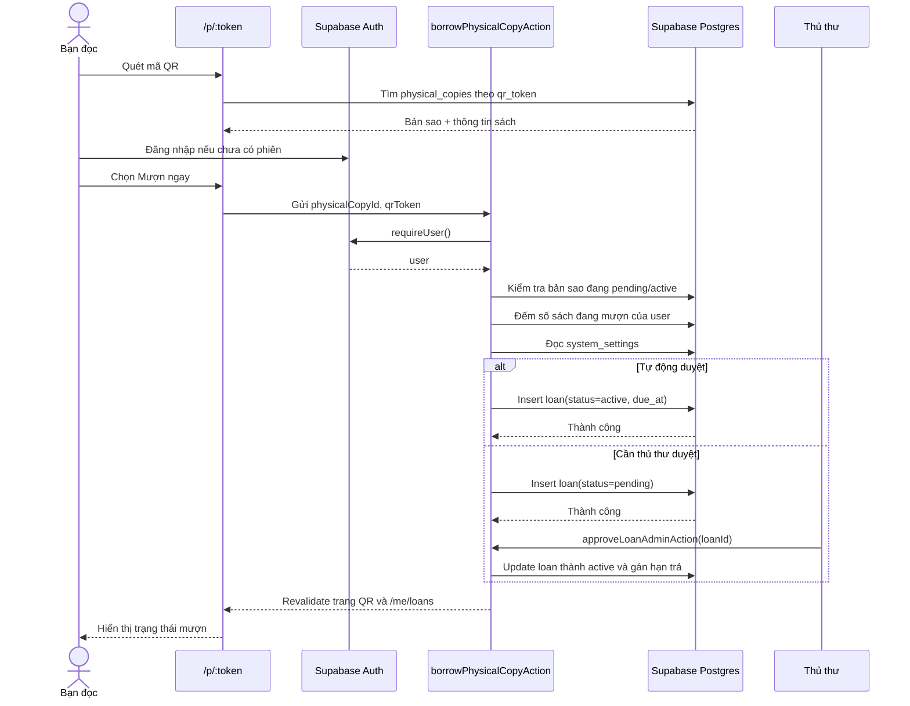
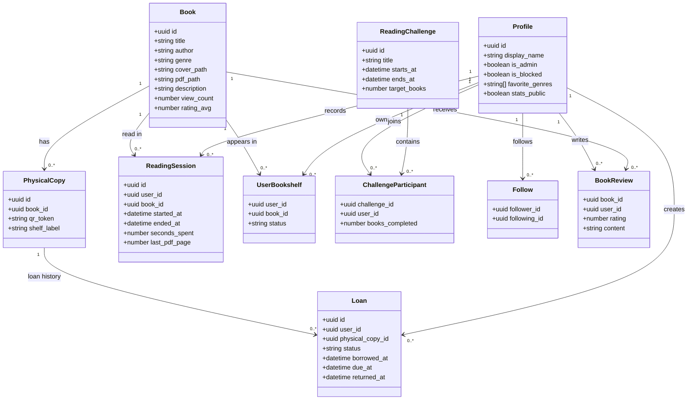

# UML sơ đồ website Thư viện Số Lá Xanh

Tài liệu này mô tả kiến trúc và các luồng chính được suy ra từ `src/app`, Server Actions, API Routes và Supabase hiện tại.

## 1. Sơ đồ chức năng và điều hướng

```mermaid
flowchart TD
    Visitor[Khách truy cập]
    Reader[Bạn đọc đã đăng nhập]
    Librarian[Quản trị viên / thủ thư]
    Cron[Vercel Cron]

    subgraph Public[Website công khai]
        Home[Trang chủ /]
        About[Giới thiệu /gioi-thieu]
        Books[Kho sách /books]
        Detail[Chi tiết sách /books/:id]
        Read[Đọc PDF /books/:id/read]
        Listen[Nghe audio /books/:id/listen]
        QR[Trang bản giấy QR /p/:token]
        Profile[Hồ sơ công khai /u/:id]
    end

    subgraph Auth[Xác thực]
        Login[Đăng nhập /login]
        Signup[Đăng ký /signup]
        Reset[Đặt lại mật khẩu /reset]
        Password[Cập nhật mật khẩu /update-password]
        Callback[OAuth callback /auth/callback]
        Blocked[Tài khoản bị khóa /blocked]
    end

    subgraph Community[Cộng đồng]
        Hub[Hub /community]
        Feed[Feed /community/feed]
        Chat[Chatbot thủ thư AI /community/chat]
        Challenges[Thử thách /community/challenges]
        Quotes[Trích dẫn /community/quotes]
        Suggestions[Gợi ý theo dõi /community/suggestions]
    end

    subgraph Account[Tài khoản cá nhân]
        Me[Tài khoản /me]
        Edit[Sửa hồ sơ /me/edit]
        Shelf[Tủ sách /me/shelf]
        Stats[Thống kê /me/stats]
        Loans[Mượn sách /me/loans]
    end

    subgraph Admin[Khu vực quản trị, yêu cầu is_admin]
        AdminBooks[Quản lý sách /admin/books]
        NewBook[Thêm sách /admin/books/new]
        EditBook[Sửa sách /admin/books/:id/edit]
        Copies[QR bản sao /admin/books/:id/copies]
        Import[Import CSV /admin/import]
        AdminLoans[Duyệt mượn trả /admin/loans]
        AdminUsers[Quản lý thành viên /admin/users]
        Reading[Lịch sử đọc /admin/users/:id/reading]
        Reports[Báo cáo /admin/reports]
        Settings[Cài đặt /admin/settings]
        NewChallenge[Tạo thử thách /admin/challenges/new]
    end

    Visitor --> Home
    Visitor --> About
    Visitor --> Books
    Visitor --> Detail
    Visitor --> QR
    Visitor --> Profile
    Visitor --> Login
    Visitor --> Signup
    Visitor --> Reset

    Books --> Detail
    Detail --> Read
    Detail --> Listen
    Detail --> Login
    Detail --> QR
    Home --> Books
    Home --> Hub
    About --> Chat

    Login --> Callback
    Callback --> Home
    Reset --> Password
    Login -. Tài khoản bị khóa .-> Blocked

    Reader --> Me
    Reader --> Shelf
    Reader --> Stats
    Reader --> Loans
    Reader --> Feed
    Reader --> Chat
    Reader --> Challenges
    Reader --> Quotes
    Reader --> Suggestions
    Reader --> Profile
    Reader --> QR

    Hub --> Feed
    Hub --> Chat
    Hub --> Challenges
    Hub --> Quotes
    Hub --> Suggestions
    Me --> Edit
    Me --> Shelf
    Me --> Stats
    Me --> Loans
    Profile -. Theo dõi / bỏ theo dõi .-> Feed
    QR -. Mượn / trả .-> Loans

    Librarian --> AdminBooks
    AdminBooks --> NewBook
    AdminBooks --> EditBook
    AdminBooks --> Copies
    AdminBooks --> Import
    AdminBooks --> AdminLoans
    AdminBooks --> AdminUsers
    AdminBooks --> Reports
    AdminBooks --> Settings
    AdminBooks --> NewChallenge
    AdminUsers --> Reading
    Librarian -. Duyệt mượn .-> AdminLoans

    Cron -->|Nhắc hạn trước 2 ngày| AdminLoans
```

## 2. Sơ đồ component và tích hợp

## 3. Sơ đồ use case chính

## 4. Sequence: mượn sách giấy bằng QR

## 5. Mô hình dữ liệu nghiệp vụ chính

## Ghi chú quyền truy cập

- Các trang đọc, tủ sách, thống kê, mượn sách và thao tác cộng đồng dùng `requireUser()` khi cần người dùng xác thực.
- Khu vực `/admin/*` được bảo vệ ở `src/app/admin/layout.tsx` và kiểm tra `profiles.is_admin`.
- API AI yêu cầu đăng nhập; AI sử dụng Gemini trước và có thể fallback sang OpenAI tùy biến môi trường.
- Cron nhắc hạn yêu cầu `CRON_SECRET` hoặc header `x-vercel-cron: 1`, sau đó dùng Supabase service role.
